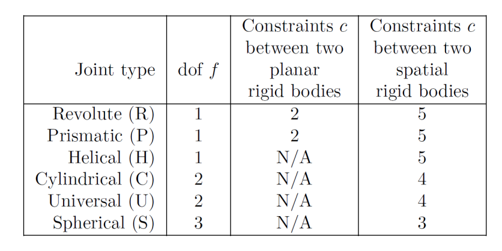
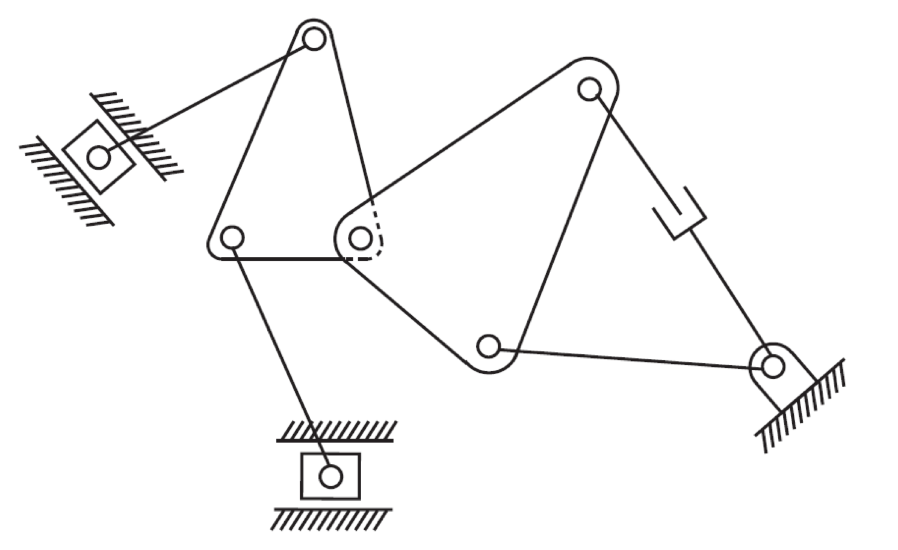
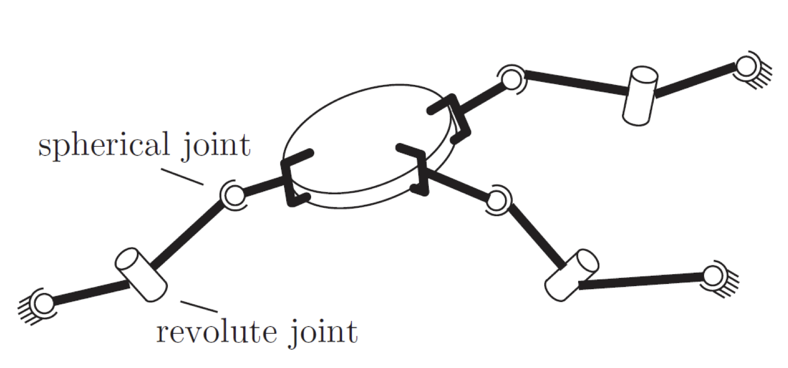
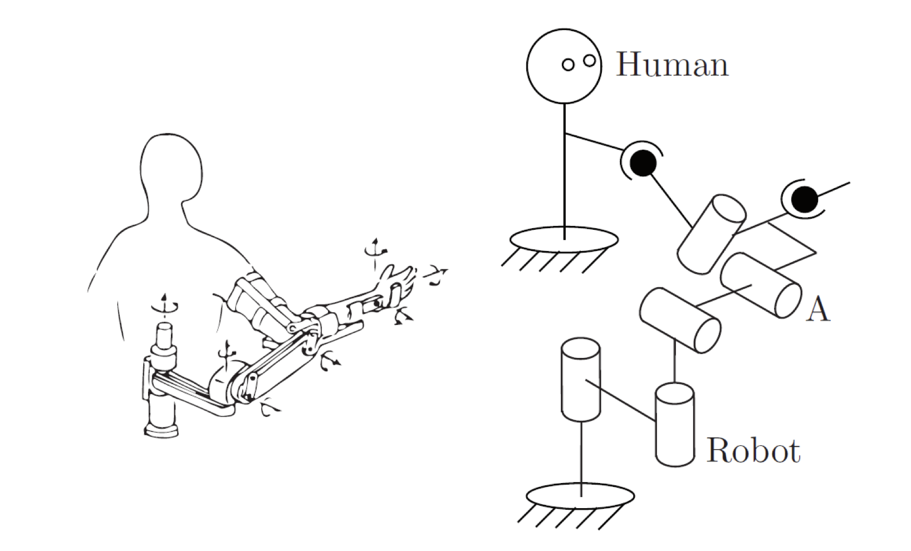
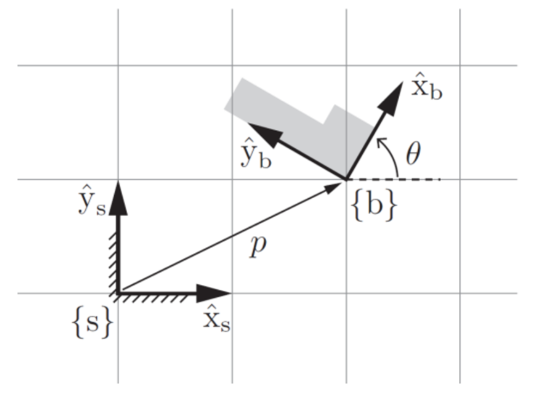
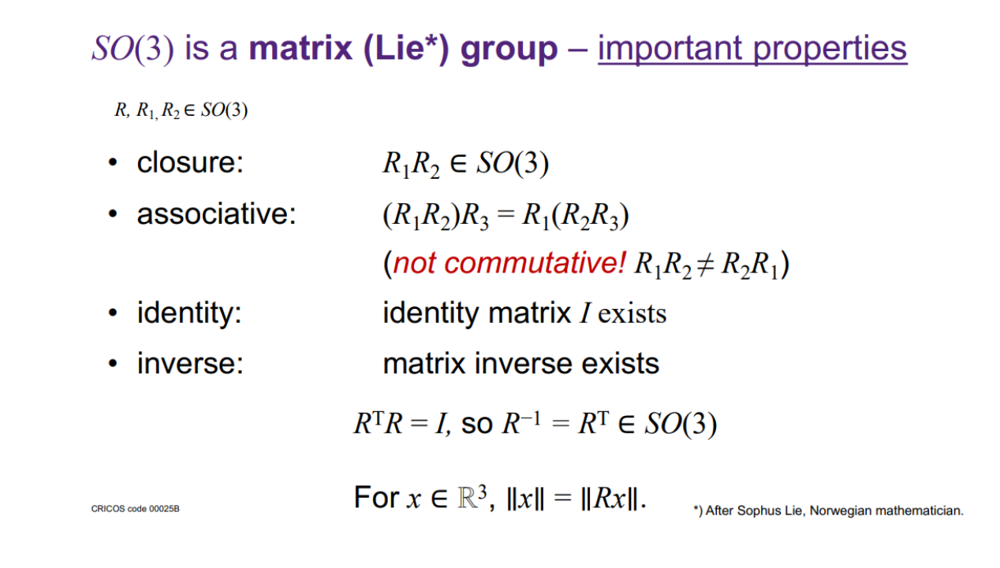

# METR4202
## Robotics & Automation
### Week 1: Tutorial - Degrees of Freedom & Configuration Space

---

# A review of Grübler's Formula

$$
\begin{aligned}
\mathrm{dof} &= m(N - 1) - \sum_{i = 1}^{J}c_{i} \\
 &= m(N - 1 - J) + \sum_{i = 1}^{J}f_{i}
\end{aligned}
$$

---

# Definitions

**C-Space** (Configuration Space): The space of all configurations

**Degrees of freedom**: Dimension of the C-Space

**Task Space**: The space in which the robot's task is naturally expressed

**Workspace**: A specification of the reachable configurations of the end-effector

---

# Table of Joint Constraints

---

# Exercise 1: Planar Mechanism

---

# Exercise 2: Spatial Mechanism

---

# Exercise 3: Upper-Limb Exoskeleton

---

# 2D Rotations as Matrices

$$
R =
\begin{bmatrix}
\cos{(\theta)} & -\sin{(\theta)} \\
\sin{(\theta)} & \cos{(\theta)}
\end{bmatrix}
$$
<!-- ## Rotations in 3D
$$
R_x =
\begin{bmatrix}
\cos{(\theta)} & -\sin{(\theta)} \\
\sin{(\theta)} & \cos{(\theta)}
\end{bmatrix}
$$ -->
---

# The SO3 Group
